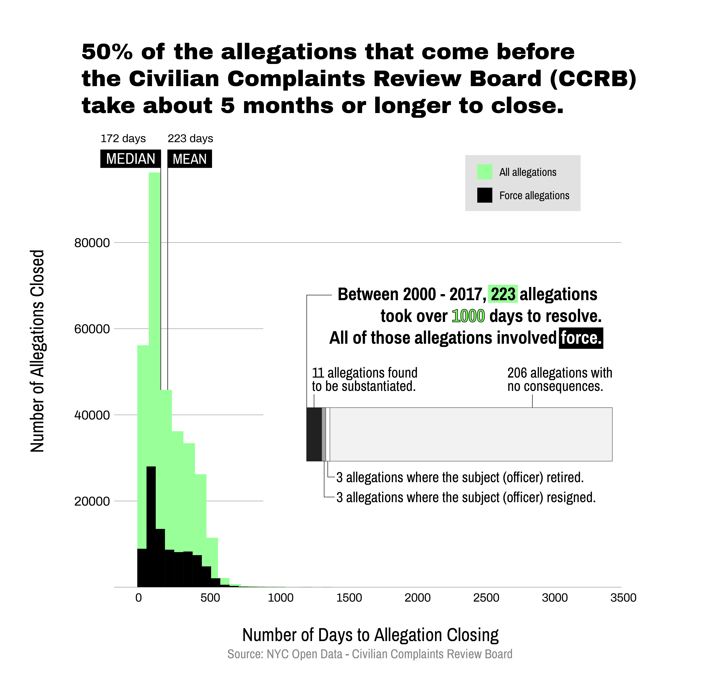

# NYC Civilian Complaints Review Board - Allegations Data

I'm starting off this endeavor in a easy note -- this is a dataset I've worked with before, and in fact, ran an ["Introduction to Data Visualization with Python + Adobe Illustrator"](https://docs.google.com/presentation/d/1X69-d6EAPBBf_ncV0V0-MEO6IY-PXmATZFJpgkoc1Yo/edit#slide=id.g888cfe5bb7_1_39) workshop for ITP Camp 2020 earlier this summer, in which I centered my work in this data. However, as the workshop did not emphasize the final output, I thought this would be a nice opportunity to revisit the dataset. 

Original data source [here](https://data.cityofnewyork.us/Public-Safety/Civilian-Complaint-Review-Board-CCRB-Allegations-C/xyq2-jjkn). 

## Day 1: Python + Illustrator Output

* Median is a helpful measure when the data is skewed or has outliers as it is ["robust against outliers"](https://www.clinfo.eu/mean-median/). In this case, I included both mean and median, as they were not wildly different from one another. 

## Day 2: D3

## Day 3: After Effects