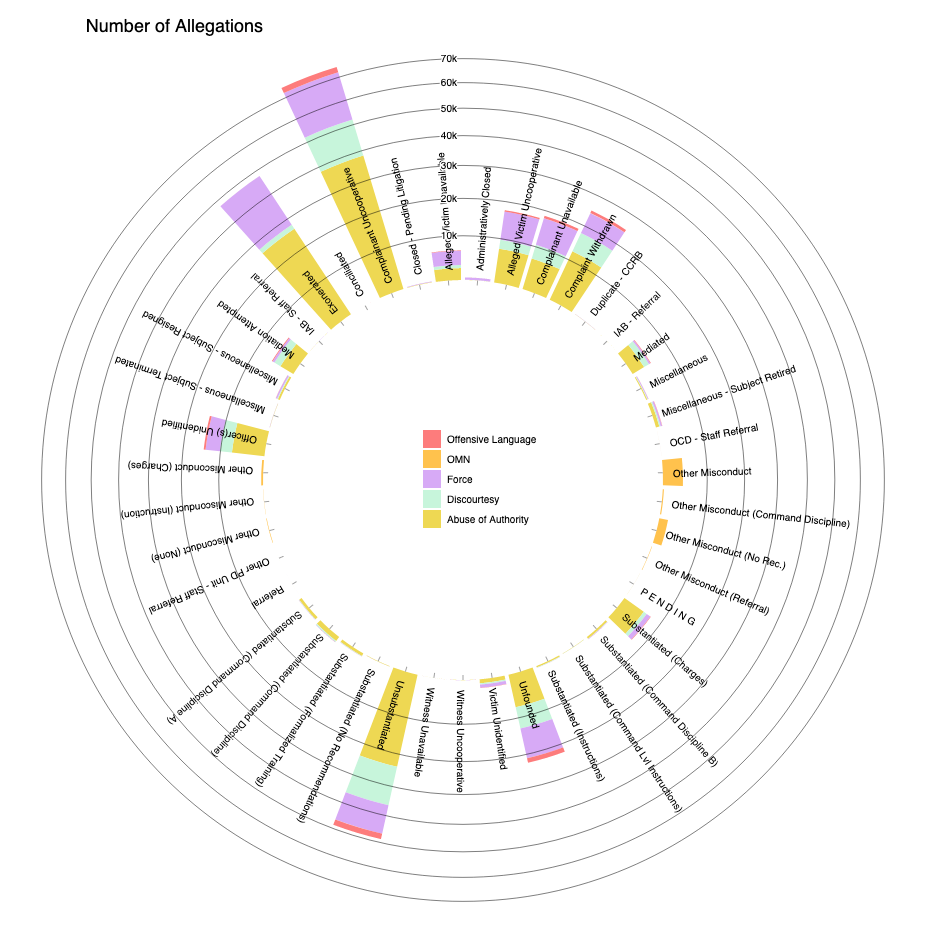

# NYC Civilian Complaints Review Board - Allegations Data

I'm starting off this endeavor in a easy note -- this is a dataset I've worked with before, and in fact, ran an ["Introduction to Data Visualization with Python + Adobe Illustrator"](https://docs.google.com/presentation/d/1X69-d6EAPBBf_ncV0V0-MEO6IY-PXmATZFJpgkoc1Yo/edit#slide=id.g888cfe5bb7_1_39) workshop for ITP Camp 2020 earlier this summer, in which I centered my work in this data. However, as the workshop did not emphasize the final output, I thought this would be a nice opportunity to revisit the dataset. 

Original data source [here](https://data.cityofnewyork.us/Public-Safety/Civilian-Complaint-Review-Board-CCRB-Allegations-C/xyq2-jjkn). 

## Day 1: Python + Illustrator Output

* Median is a helpful measure when the data is skewed or has outliers as it is ["robust against outliers"](https://www.clinfo.eu/mean-median/). In this case, I included both mean and median, as they were not wildly different from one another. 

## Day 2: D3 / HTML / CSS

+ [Observable for Jupyter Users](https://observablehq.com/@observablehq/observable-for-jupyter-users)
    + I probably won't use Observable just yet, but I'm interested to see if this can become a helpful part of my workflow for future "Day 2" endeavors. 
    + [Observable’s not JavaScript](https://observablehq.com/@observablehq/observables-not-javascript) – learning this the hard way. 
    + [Observable: Charting with Vega-Lite](https://observablehq.com/@observablehq/vega-lite)
+ [Changes between D3v4 & D3v5](https://github.com/d3/d3/blob/master/CHANGES.md): everything I used to know is obsolete (sort of).
+ [Async in D3v5](https://stackoverflow.com/questions/49599691/how-to-load-data-from-a-csv-file-in-d3-v5)
+ [Documentation for d3-shape](https://github.com/d3/d3-shape/blob/v1.3.7/README.md#stack)
+ [D3v5 Observable: Radial Stacked Chart](https://observablehq.com/@d3/radial-stacked-bar-chart)

This attempt at fancy D3 has been humbling! Not sure why I decided to start the series with a radial stack bar chart (cough, cough, hubris), but I ran into a quite a bit of trouble getting D3v5 code up and running (or even recreating the sample code locally). I wasn't experiencing an explicit error (beyond the bars not appearing), so I imagine the is a very simple, very stupid syntax/semi-colon/spelling error that lurks somewhere. 

Instead, I switched to playing around with some d3v4 sample code for the results shown below: 

There are about a million ways this chart could be improved -- and I would emphasize that **THIS IS NOT A FINISHED CHART**. However, for the sake of the PURPOSE of this "100 Days" endeavor, I think it's time to move on.

For my next d3 chart, I do want to work with d3v5, but I think I'm going to first try to make the SIMPLEST bar charts or line charts for the next few datasets. \~LESSON LEARNED\~. 

## Day 3: After Effects

+ [AE: Animate Graphics with Data / JSON](https://helpx.adobe.com/after-effects/how-to/create-data-driven-animations.html)
+ [Youtube: Make easy bar graphs in After Effects](https://www.youtube.com/watch?v=K95AsDjlEiM): Involves dividing by pizel size of text elements such as a period. I don't love this method, but maybe there's some power to it. 
+ [Youtube: Creatively Using Text Animators in After Effects](https://youtu.be/plbsdkRhy8g)